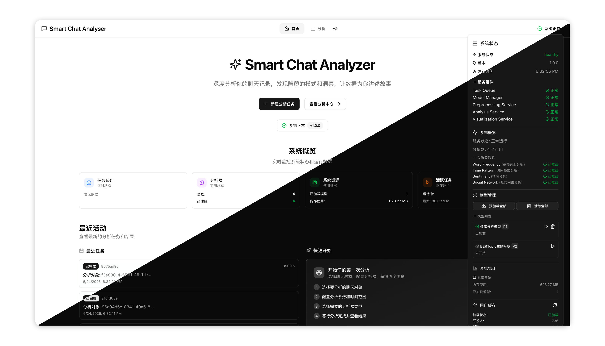

  

    
  

  <h1 align="center"><b>Smart Chat Analyzer Frontend</b></h1>
  

    深度分析你的聊天记录，发现隐藏的模式和洞察，让数据为你讲述故事
     
     
    <b>Download for </b>
    <a href="https://github.com/wibus-wee/smart-chat-analyser-frontend/archive/refs/heads/main.zip">Source Code</a>
    ·
    <b>Related Projects: </b>
    <a href="https://github.com/wibus-wee/smart-chat-analyser">Backend Repo</a>
     
  

> [!NOTE]
>
> 项目使用了 Augment Code 作为一路 Vibe Coding 的插件，但是我暂时还没找到能导出该项目聊天记录的插件。因此目前先将此项目的 Augment Memories 公布出来
>
> 由于维护精力的问题，该项目开源之日应该就是我的停更之日，但是非常欢迎 Issues & Pull Request

## 🚀 功能特性

- **现代化设计**: 扁平化设计风格，避免过度阴影效果
- **流畅动画**: 使用 Framer Motion 实现丝滑的页面过渡和交互动画
- **响应式布局**: 避免传统侧边栏布局，采用全屏流式设计
- **实时监控**: 任务状态实时更新和进度监控
- **类型安全**: 完整的 TypeScript 类型定义和 SDK 集成

## 🛠️ 技术栈

- **前端框架**: React 19 + TypeScript
- **构建工具**: Vite
- **路由**: TanStack Router
- **UI 组件**: shadcn/ui (避免使用 Card 组件)
- **动画**: Framer Motion
- **数据获取**: SWR + ofetch
- **图表**: Recharts (待实现)
- **模态框**: vaul Drawer

## 📋 当前实现状态

### ✅ 已完成
- [x] 基础布局和导航系统
- [x] 系统健康状态监控 (Popover 显示)
- [x] 任务创建界面 (Drawer 形式)
- [x] 任务状态监控和进度显示
- [x] 响应式设计和动画效果
- [x] SDK 集成和数据获取
- [x] 图表组件实现 (使用 Recharts)
- [x] 历史记录管理
- [x] 结果详情展示
- [x] 主题切换
- [ ] 错误处理优化

### 📝 待实现
- [ ] 数据导出功能
- [ ] 国际化支持

## 📖 API 文档

详细的 SDK 使用说明请参考 [README_SDK.md](./README_SDK.md)

## 📷 截图

## Author

Smart Chat Analyser Frontend © Wibus, Released under MIT. Created on Jun 21, 2025

> [Personal Website](http://wibus.ren/) · [Blog](https://blog.wibus.ren/) · GitHub [@wibus-wee](https://github.com/wibus-wee/) · Telegram [@wibus✪](https://t.me/wibus_wee)
